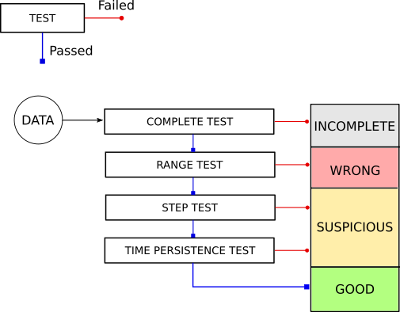

# **QUALITY CHECK OF DATA FROM WEATHER STATIONS**
Algorithm for quality check of weather station data.

The algorithm works with pandas.DataFrame objects, in which each **row** corresponds to a different **time** while data from different **variables** are placed in **columns**.

The quality check algorithm is composed by a list of consecutive tests. These tests are computed for each row. All rows are flagged according to test passed, and classified in four classes accordingly.
The quality tests considered are the following:
1. **complete test**: this test checks if all variables needed are present in each row. If test fails, the row is flagged and classified as *incomplete*;
2. **range test**: this test checks if values for each variables are in a certain range. If the test fails, the weather station is flagged and classified as *wrong*;
3. **step test**: this test checks if non-physical steps are present. If the test fails, the row is flagged and classified as *suspicious*;
4. **time persistence test**: this test checks if data can be considered time fixed. This test work on a sliding window. If the test fails, the row is flagged and classified as *suspicious*.
5. if all tests are passed, the row is flagged and classified as *good*.

See the image below for the algorithm scheme.

The user can set the configuration for each tests, and accordingly select which test must be computed - if a test is not request, it is considered as passed. See **example.ipynb** notebook for examples.

### Default configuration: RISICO LIVE network
Default configuration (see *settings.py* file) is setted for the quality check of data from weather stations used for the RISICO LIVE network. RISICO LIVE network is the network of weather stations of the Italian Civil Protection Department in which RISICO model is implemented (for more details on the model see: Perello, N.; Trucchia, A.; D’Andrea, M.; Esposti, S.D.; Fiorucci, P. RISICO, An Enhanced Forest Fire Danger Rating System: Validation on 2021 Extreme Wildfire Season in Southern Italy. Environ. Sci. Proc. 2022, 17, 37. https://doi.org/10.3390/environsciproc2022017037). The time step of data acquisition for the RISICO LIVE network is *10 minutes*.

---
## **Versioning**
We use [SemVer](https://semver.org/) for versioning.

---
## **License**
This program is free software: you can redistribute it and/or modify it under the terms of the GNU General Public License as published by the Free Software Foundation, either version 3 of the License, or (at your option) any later version.

This program is distributed in the hope that it will be useful, but WITHOUT ANY WARRANTY; without even the implied warranty of MERCHANTABILITY or FITNESS FOR A PARTICULAR PURPOSE. See the GNU General Public License for more details.

You should have received a copy of the GNU General Public License along with this program. If not, see <https://www.gnu.org/licenses/>.
